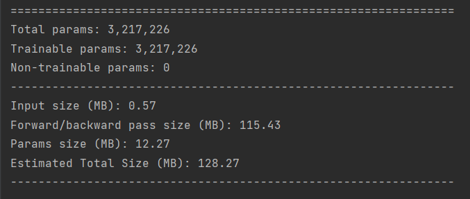

# MobilenetV1 代码
## MobilenetV1 参数
Input size = (3,224,224)

## Run command
```python -m torch.distributed.launch --nproc_per_node=2 train.py ```
## DDP简介
 将训练数据分成更小的块，让每个GPU或机器处理一个单独的数据块。然后将每个节点的结果组合起来，用于更新模型参数。在数据并行中，模型体系结构在每个节点上是相同的，但模型参数在节点之间进行了分区。每个节点使用分配的数据块训练自己的本地模型，在每次训练迭代结束时，模型参数在所有节点之间同步。
* 分布式的model在多个进程中始终保持参数一致，互相影响
* 数据分配，每个进程获得batch中的一份数据
* 只需要在一个进程上evaluation就OK
  
